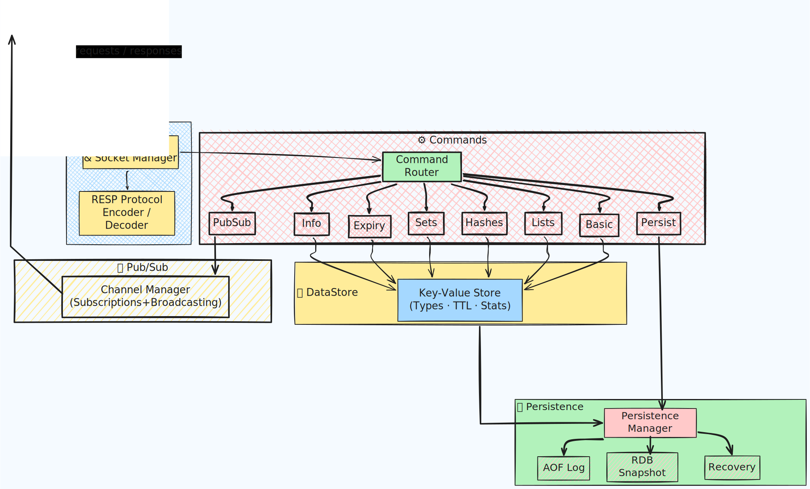

# Mini Redis

[](https://www.python.org/)

A Redis implementation built from scratch in Python with support for core Redis commands, data structures, persistence, and pub/sub messaging.

## Features

- Non-blocking event loop for concurrent multi-client connections
- Core Redis commands: SET, GET, DEL, EXPIRE, KEYS, EXISTS
- Data structures: Lists, Hashes, Sets
- Key expiration with TTL/PTTL
- Pub/Sub messaging system
- Persistence: RDB snapshots and AOF (Append-Only File)
- Data recovery on startup
- TCP server compatible with telnet and Redis clients
- Test suite with pytest

## System Overview

The system is organized into distinct layers that handle different concerns:

**Server Layer**: Non-blocking event loop using select() for managing multiple concurrent client connections over TCP.

**Command Layer**: Command dispatcher that routes incoming Redis commands to specialized handlers for basic operations, lists, hashes, sets, expiration, persistence, info, and pub/sub.

**Storage Layer**: In-memory key-value store with type tracking, expiration management, and memory usage statistics.

**Persistence Layer**: Coordinates RDB snapshots and AOF logging with configurable sync policies. Includes recovery manager for data restoration.

**Pub/Sub Layer**: Manages channel subscriptions and publishes messages to subscribers in real-time.

**Response Layer**: RESP protocol implementation for formatting server responses.

### System Architecture Diagram



## Project Context

Built as a learning project to understand Redis internals and Python concurrency patterns. Implemented over several months with features added in incremental stages across git branches.
## Installation

### Clone the repository
```bash
git clone https://github.com/mahi-anol/Mini-Redis-Coded-from-Scratch.git
```
## Go to project dir
```
cd Mini-Redis-Coded-from-Scratch.git
```
## Installing virtual Environment (optional)
```
# Windows
python -m venv .venv
.\.venv\Scripts\activate

# Linux/macOS
python3 -m venv .venv
source .venv/bin/activate
```
## Installing package
```
# Windows
pip install .
# linux
pip3 install .
```
## Now open 2 separate terminal instance
```
##  In first terminal do:
# For Windows
python main.py

# For linux
python3 main.py
```
## Now in other terminal do:
```
telnet localhost 6379
# After this we are connected to the server.
```
## Now we can try redis commands
```
PING
SET A 5
GET A
LPUSH B a b c d e
GET B
```
<p> when you stop the server and restart again you'll see that the server is storing the state from backups and and key value pair will be restored along with their meta data. </p>
<p> Also you can check multi client concurrency with by connecting multiple telnet seesion from different terminals.
---

## TODOs:
- Implementing the pattern based PUB SUB methods.
- creating better documentation.

## Author
**Mahi Sarwar Anol**
- Email: anol.mahi@gmail.com  
- GitHub: [mahi-anol](https://github.com/mahi-anol)  
- LinkedIn: [Mahi Sarwar Anol](https://www.linkedin.com/in/mahi-anol)  